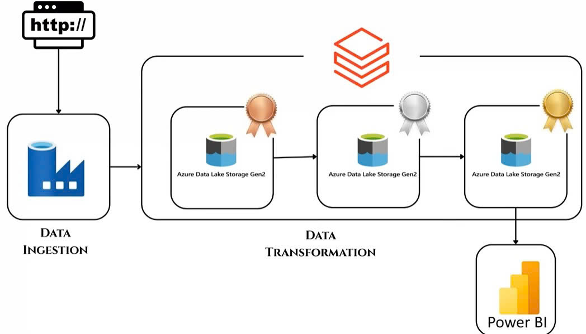

# Azure ETL Pipeline Project

## Project Overview
This project demonstrates an end-to-end ETL pipeline using Azure services to ingest, transform, enrich, and visualize raw data obtained from Kaggle. The raw data is downloaded from Kaggle, uploaded to a Git repository, and the HTTP link of the raw data from the repository is used for ingestion. The pipeline leverages Azure Data Factory, Azure Databricks, Azure Key Vault, Azure Storage Account, and Power BI to process and analyze data effectively.

## Data Pipeline Architecture

## Key Features
1. **Data Ingestion**:
   - Raw data is fetched via HTTP from a Git repository (after being uploaded from Kaggle) and ingested into the Bronze container of an Azure Storage Account using Azure Data Factory.

2. **Secure Access Configuration**:
   - An Azure App Registration is created, with certificates and secrets added to enable Azure Databricks to securely access and interact with the data.
   - Secrets are stored in Azure Key Vault, and a secret scope is created in Databricks to retrieve these secrets for secure connections.

3. **Data Transformation**:
   - Azure Databricks is used to transform the raw data and save it in Parquet format in the Silver container of the Azure Storage Account.

4. **Data Enrichment**:
   - Further data enrichment is performed using Azure Databricks, and the enriched data is saved as tables in the Gold container of the Azure Storage Account.
   - A database and table are created to enable Power BI to connect and query the data.

5. **Data Visualization**:
   - Power BI is used to explore the processed data and create insightful charts and dashboards for analysis.

## Tools and Technologies
- **Azure Data Factory**: For orchestrating data ingestion workflows.
- **Azure Databricks**: For data transformation and enrichment.
- **Azure Key Vault**: For securely storing secrets and certificates.
- **Azure Storage Account**: For managing Bronze, Silver, and Gold containers.
- **Power BI**: For data visualization and insights generation.

## Outcome
This project showcases the ability to design and implement a scalable and secure ETL pipeline on Azure, transforming raw data into meaningful insights through advanced analytics and visualization tools.